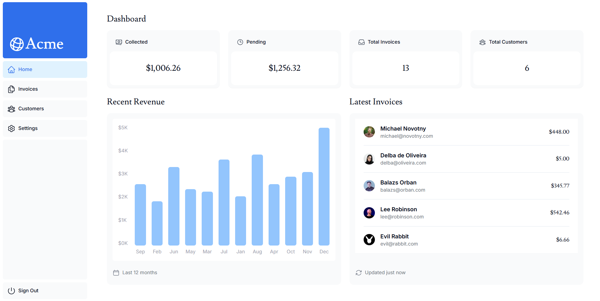
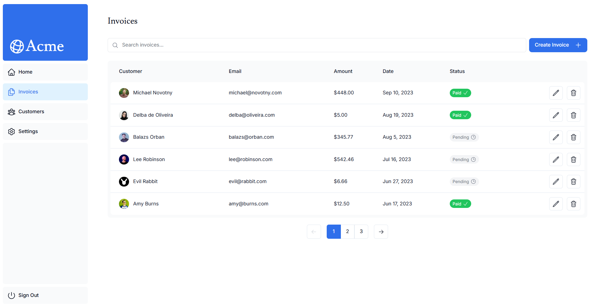
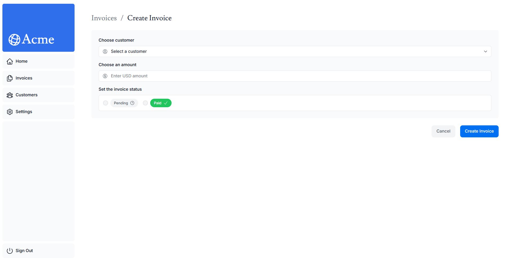
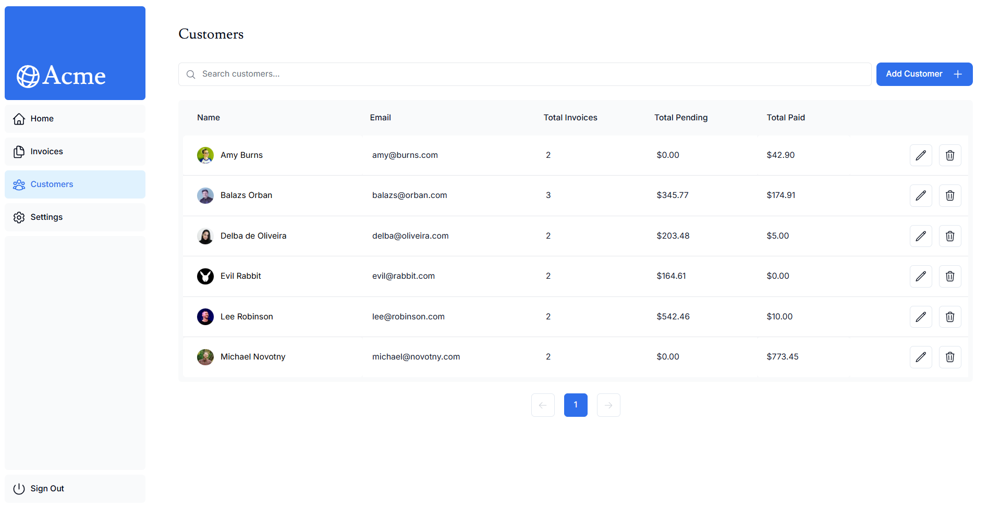
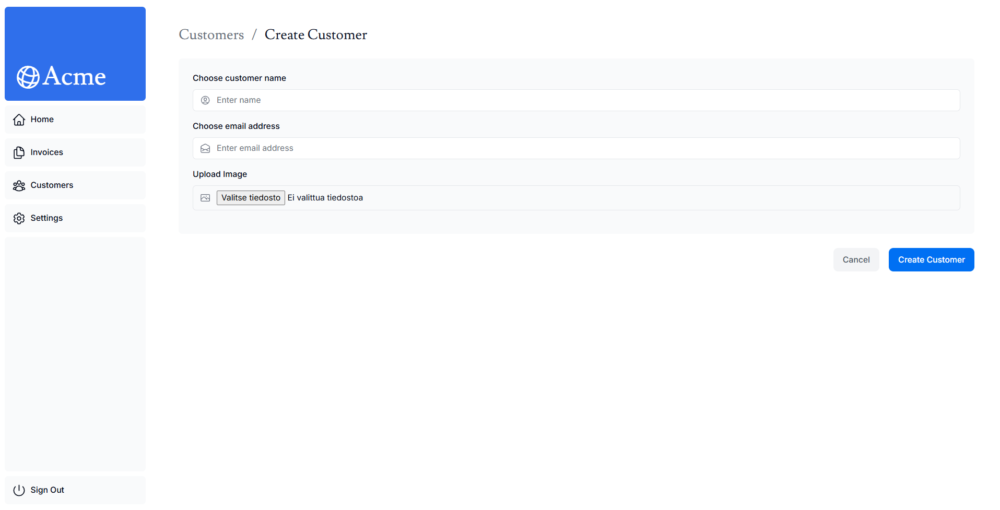
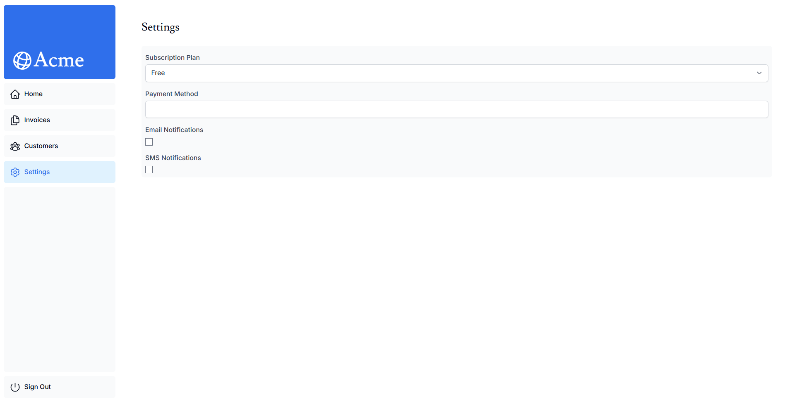

## Next.js Financial Dashboard

This project is a full-stack financial dashboard application built with Next.js 15 and TypeScript. It's based on the Next.js App Router Course, with additional features built by myself.
For more information, see the [App Router Course](https://nextjs.org/learn/dashboard-app) on the Next.js Website.

### Table of Contents

- [Features](#features)
- [Tech Stack](#tech-stack)
- [Installation](#installation)
- [Upcoming Features](#upcoming-features)

### Features

- Real-time dashboard with financial data visualization
- User authentication and authorization
- Ability to manage customers and invoices
- Responsive design for mobile and desktop

### Tech Stack

- **Next.js 15**
- **TypeScript**
- **Tailwind**
- **PostgreSQL**
- **NextAuth.js**
- **ESLint**
- **Docker Compose**

### Installation

To get started with the project, follow these steps:

1. Clone the repository:
   ```bash
   git clone https://github.com/pr0fix/financial-dashboard.git
   ```
2. Navigate to the project directory:
   ```bash
   cd financial-dashboard
   ```
3. Install the dependencies:

   ```bash
   npm install
   ```

4. Run a containerized Postgres database:

   ```bash
   docker-compose up
   ```

5. Seed the database with sample data by running this in the root of the project:

   ```bash
   npm run seed
   ```

6. Run the development server:

   ```bash
   npm run dev
   ```

7. Open your browser and visit `http://localhost:3000` to see the application in action!

### Screenshots

#### Dashboard



#### Invoices



#### Create Invoice



#### Customers



#### Create Customer



#### Settings



### Upcoming Features

- [x] Edit customer details
- [x] Delete customer
- [x] Implement alert dialog component
- [x] Add alert dialog to deletion of customer
- [x] Add alert dialog to editing of customer
- [x] Add alert dialogs to deleting and editing an invoice
- [ ] Real data charts instead of current representational ones
- [x] Feature to see when the data was last updated
- [x] Initialize Jest to write unit-tests
- [ ] Write end-to-end tests
- [ ] Deploy the application & update pipeline configuration
- [ ] Settings page for changing theme and other preferences
- [x] Sign up feature
- [x] Create a fallback to homepage with error message for when database isn't accessible
- [ ] Create loading skeletons for components
- [ ] Style the image upload on create customer-page
- [ ] Fix the issue where new data isn't updated on deployed version
